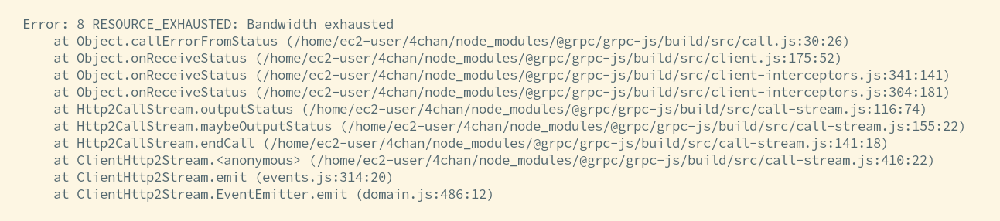

-   Fix paragraph breakup

Editing pipeline

-   Song
-   Intro
-   Outro
-   Transition

More voices support

## dsadsa

Nuvarande processen är:
ändra i serverkod,
starta om servern,
ladda om applikationen,
gå till delen där den ändrade delen används,
testa,
om det inte funkar, gå tillbaks till första steget.

Testing i detta fallet skulle öka hastigheten ofantligt.
Eller automatisering med Insomnia/API-klient

## dsa

Run testing (just startup tests to start with)

Build on github actions/circleCI and push to prod server

## Problems

-   Sned text går ibland inte att klicka på
-   gifs har inget ljud när de spelas

## Todo

Fix this shit!

### Easy work

-   och sen någon progress bar som i reddit vid maker som visar hur många memes det är kvar osv, och så man kan sortera om dem
-   Theme name in file list
-   render range eller nåt
-   add pause after reveal

-   Ljud under GIF
-   när man selectar en reveal och inkluderar text, så lägger den till texten (med auto-reveal av) och en reveal för det området efter (kanske grupperar dem visuellt också)
-   om man selectar flera text-boxar på det sättet så shift-addar den automatiskt alla de texterna till en (sorterade efter y-koordinaten på textboxen)
-   Add tts reads manually CHECK
-   Short/long pause CHECK
-   Shiftclick makes boxes green CHECK
-   Show only transition times on active vids CHECK

### Lots of work:

-   Swear word filter
-   Ladda upp alla bilder i S3 storage, koppla till sam's meme-bot. Ta bort memes man redan använt ur listan
-   Save status so that you can pick up your work later. Maybe only locally.
